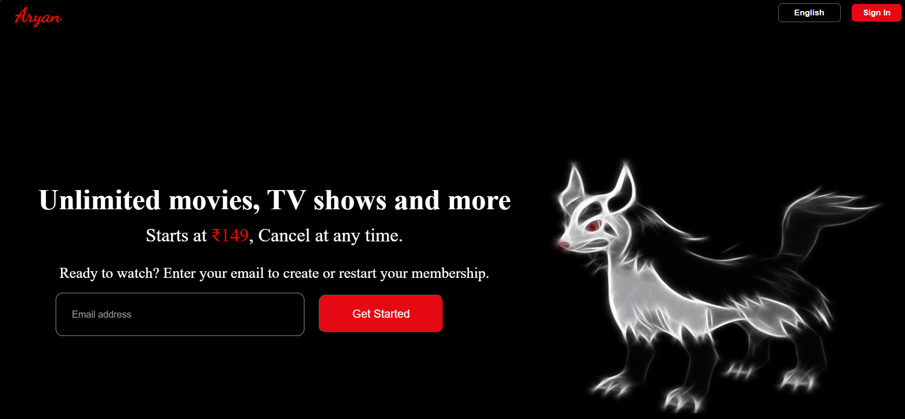
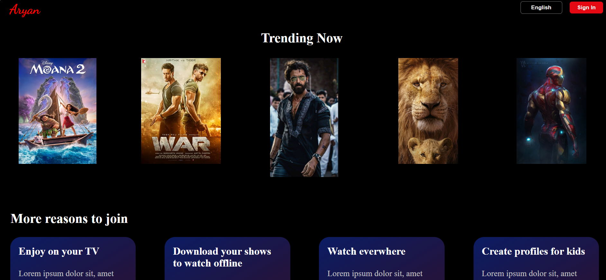
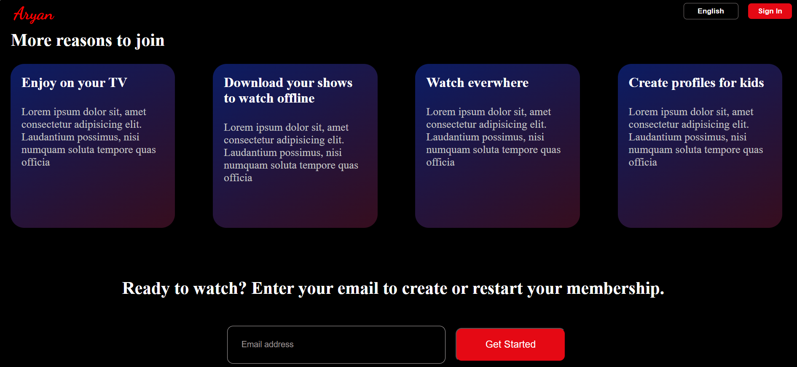

# Entertainment Website

A modern, responsive entertainment website built with HTML and CSS.

## Features

- Fully responsive design for all devices
- Clean and modern user interface
- Easy to customize and extend

## Technologies Used

- HTML5
- CSS3

## Getting Started

1. Clone the repository:
   ```bash
   git clone https://github.com/your-username/entertainment-website.git
   ```
2. Open `index.html` in your browser to view the website.

## License
This project is licensed under the MIT License.

## Images






